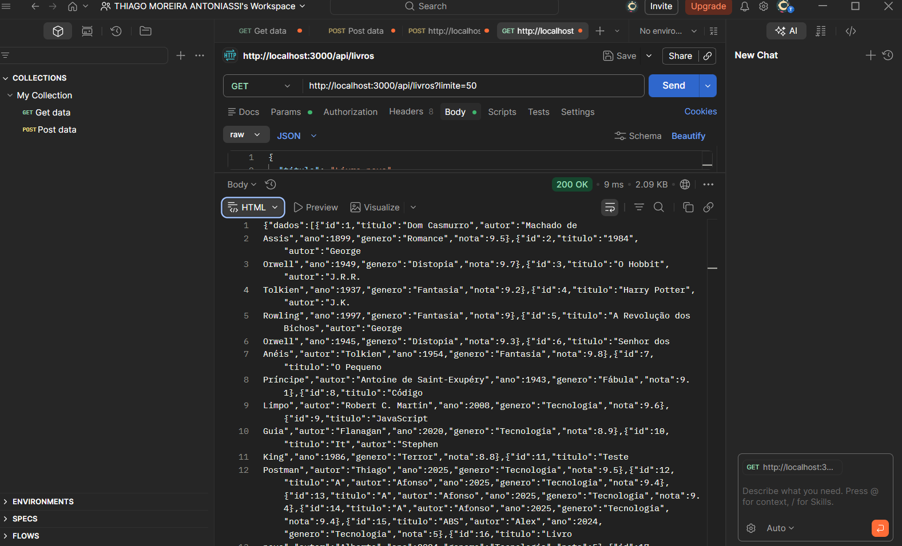
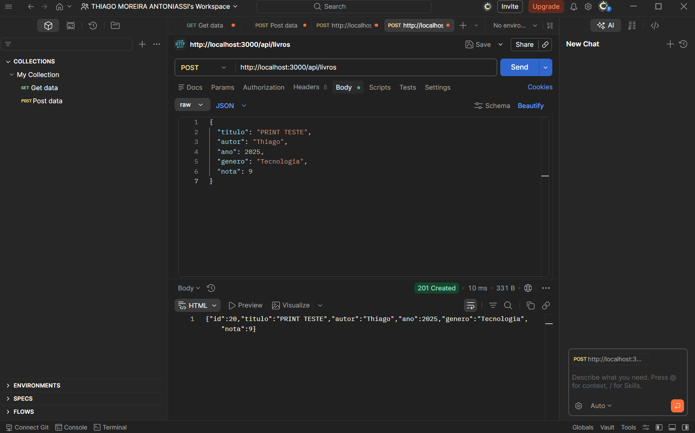
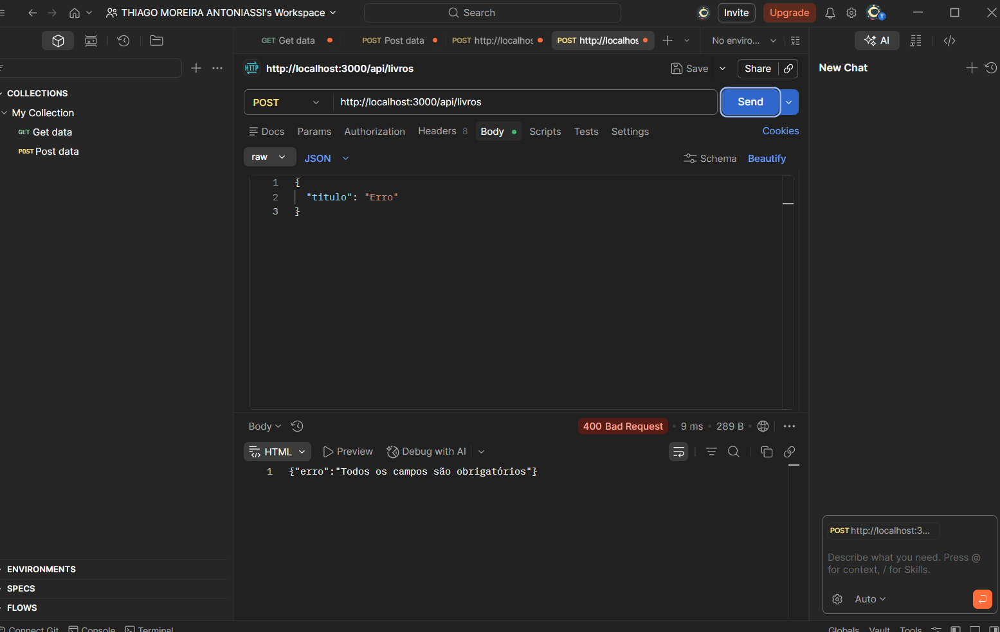

# API de Livros

## Descrição
API REST desenvolvida com Node.js e Express para gerenciamento de livros.

## Como rodar o projeto
npm install  
node index.js  

Servidor: http://localhost:3000

COLLECTION POSTMAN:

---

## Endpoints

### 1. Listar livros
Método: GET  
URL: http://localhost:3000/api/livros  
Body: não possui  

Resposta:
{
  "dados": [
    {
      "id": 1,
      "titulo": "Dom Casmurro",
      "autor": "Machado de Assis",
      "ano": 1899,
      "genero": "Romance",
      "nota": 9.5
    }
  ],
  "paginacao": {
    "pagina_atual": 1,
    "total_itens": 19
  }
}

2. Buscar livro por ID

Método: GET
URL: http://localhost:3000/api/livros/1

Body: não possui

Resposta:

{
  "id": 1,
  "titulo": "Dom Casmurro",
  "autor": "Machado de Assis",
  "ano": 1899,
  "genero": "Romance",
  "nota": 9.5
}

3. Filtrar por gênero

Método: GET
URL: http://localhost:3000/api/livros?genero=Fantasia

Body: não possui

Resposta:

{
  "dados": [
    {
      "id": 3,
      "titulo": "O Hobbit",
      "genero": "Fantasia"
    }
  ]
}

4. Ordenar livros

Método: GET
URL: http://localhost:3000/api/livros?ordem=nota&direcao=desc

Body: não possui

Resposta:

{
  "dados": [
    {
      "titulo": "1984",
      "nota": 9.7
    }
  ]
}

5. Paginação

Método: GET
URL: http://localhost:3000/api/livros?pagina=2

Body: não possui

Resposta:

{
  "dados": [],
  "paginacao": {
    "pagina_atual": 2
  }
}

6. Criar livro

Método: POST
URL: http://localhost:3000/api/livros

Body:

{
  "titulo": "Novo Livro",
  "autor": "Thiago",
  "ano": 2025,
  "genero": "Tecnologia",
  "nota": 9
}

Resposta:

{
  "id": 20,
  "titulo": "Novo Livro",
  "autor": "Thiago",
  "ano": 2025,
  "genero": "Tecnologia",
  "nota": 9
}
7. Erro de validação

Método: POST
URL: http://localhost:3000/api/livros

Body:

{
  "titulo": "Erro"
}

Resposta:

{
  "erro": "Todos os campos são obrigatórios"
}

---

Validações

Todos os campos são obrigatórios

Nota deve ser um número entre 0 e 10

Ano deve ser um número

## Testes no Postman

GET funcionando:

POST funcionando:

Erro de validação:

